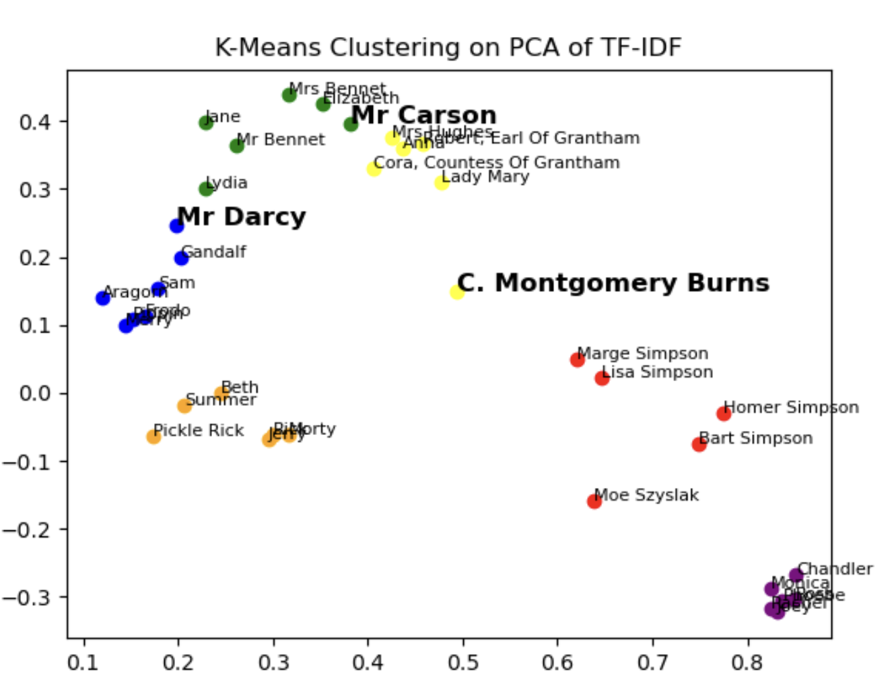
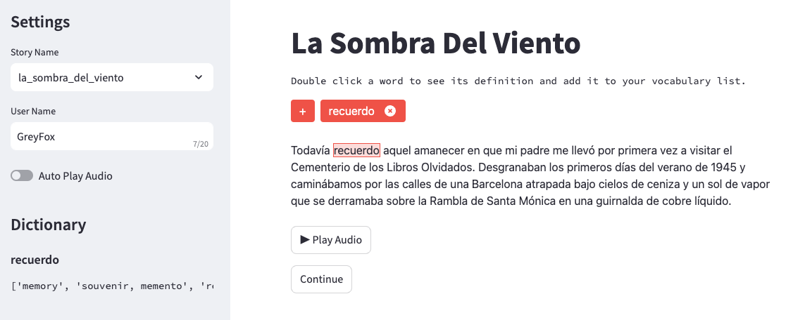
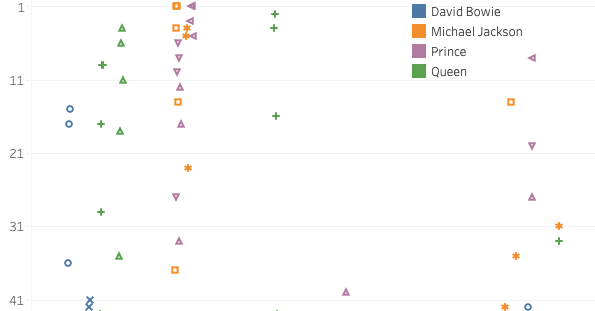
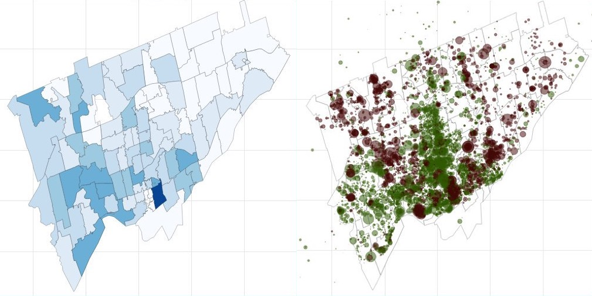

<link rel="shortcut icon" type="image/x-icon" href="images/favicon.ico">
# Projects
---

### Speaker Attribution in Written Dialogue

[Paper](https://drive.google.com/file/d/1ulLqka9SKXhHGgCkgiafdcBfkkEK4HdO/view?usp=sharing) | [GitHub](https://github.com/wluna01/isye-6740-project/tree/main/code)

### GRALE - Graded Reading through an Adaptive Language Environment

[Paper](https://drive.google.com/file/d/16rHhlAIqstzMVWWifH1ATFwNGtC3VnT1/view?usp=sharing){:target="_blank"} | [GitHub](https://github.com/wluna01/cs6460-omscs-project/tree/main?tab=readme-ov-file#grale){:target="_blank"}

### Resurrecting the Billboard Top 100 

[Tableau Dashboard](https://public.tableau.com/profile/will.luna#!/vizhome/BillboardHitsthatNeverDie/ChartToppersThatNeverDie?publish=yes){:target="_blank"}{:target="_blank"} | [Jupyter Notebook](https://www.kaggle.com/wluna01/billboard-top-100-resurrections){:target="_blank"}

---

### Mapping Furniture Donations in Greater Toronto 

[Jupyter Notebook](https://kaggle.com/wluna01/furniture-bank-data-viz-for-social-good-project){:target="_blank"}
