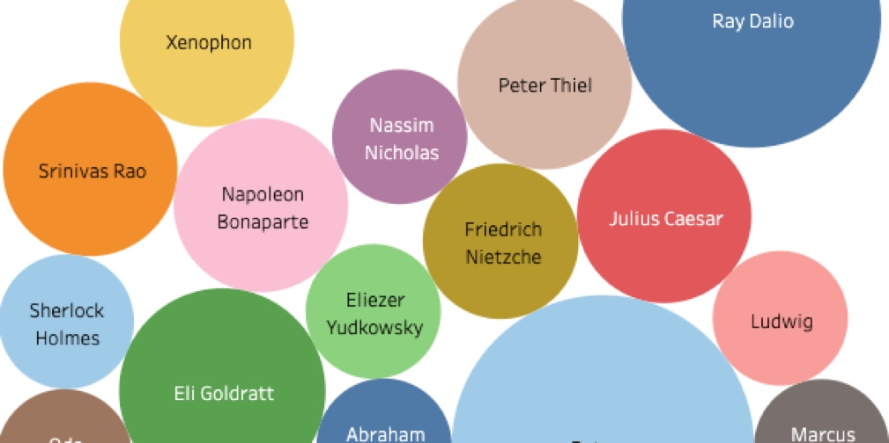

<link rel="shortcut icon" type="image/x-icon" href="images/favicon.ico">
# Projects
---
### Mapping Furniture Donations in Greater Toronto 

[Jupyter Notebook](https://kaggle.com/wluna01/furniture-bank-data-viz-for-social-good-project)

### Visualizing Intellectual Influence on Twitter

[Tableau Dashboard](https://public.tableau.com/profile/will.luna#!/vizhome/IntellectualInfluenceinTwitterPosts/Dashboard1?publish=yes)

[Jupyter Notebook](https://www.kaggle.com/wluna01/getoldtweets3-nltk-data-viz)
